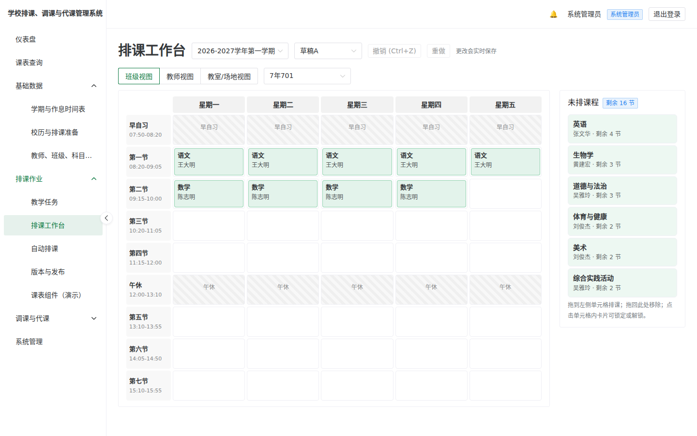
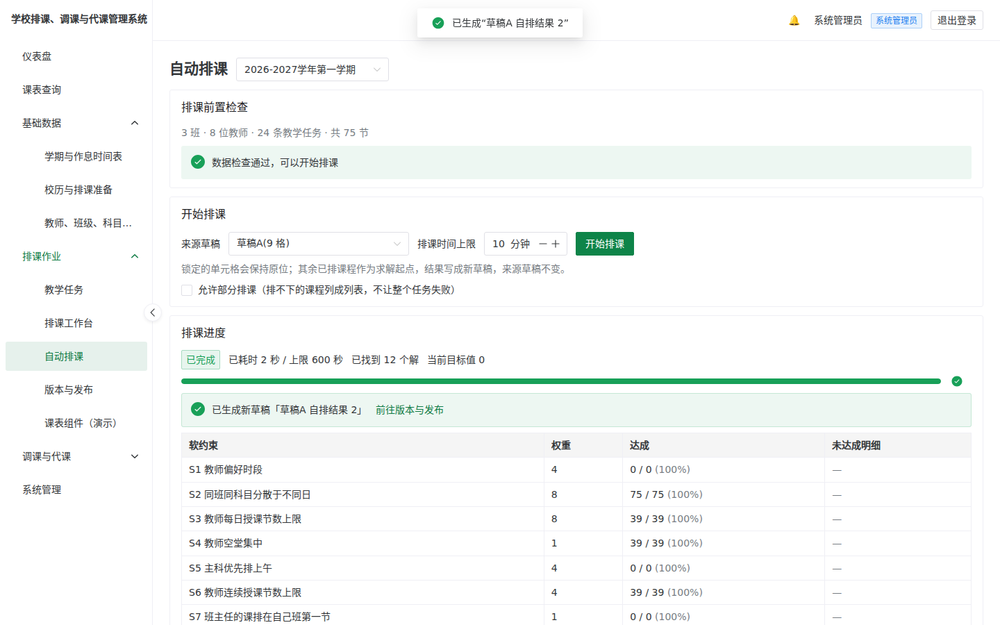
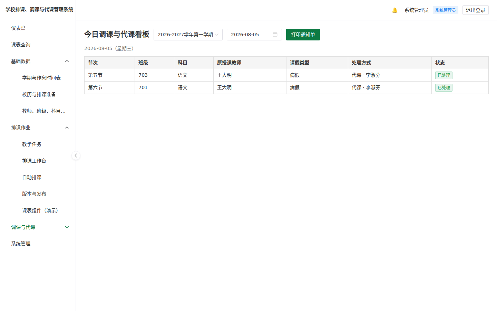
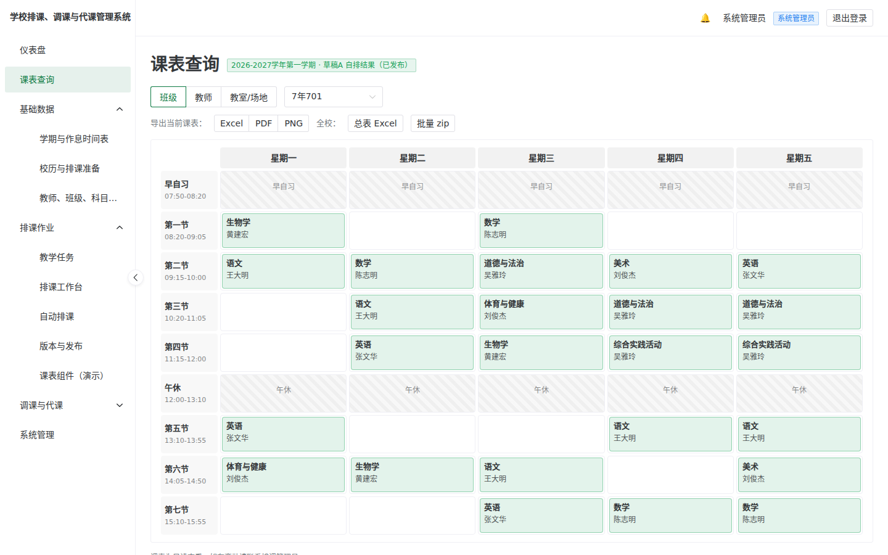

# 学校排课、调课与代课管理系统 · Course Scheduling System

[](https://github.com/begin0808/Course_Scheduling_System/actions/workflows/ci.yml)
[](LICENSE)

**开源免费、单校自建、纯 Web 的中小学排课、调课与代课管理系统。** 适用于小学、初中、普通高中、综合高中和中职，以**排课管理员**的日常工作流程为中心设计。

系统覆盖学期基础数据、教学任务、手动与自动排课（OR-Tools CP-SAT 引擎），以及学期中的请假、调课、代课、通知和课时统计。使用 Docker Compose 即可部署到校内主机，业务数据保存在学校自己的环境中。

> **English summary:** A free, open-source (MIT), self-hosted scheduling, course-change, and substitute-teaching system for schools in mainland China. It provides a Simplified Chinese interface, Gregorian academic years, the Asia/Shanghai timezone, manual and automatic scheduling, leave handling, notifications, exports, and backups.

---

## 功能总览

| 领域 | 内容 |
|---|---|
| **基础数据** | 学期与作息时间表、教师、班级、科目、教室/场地、Excel 导入、设置向导、开新学期复制、班级作息时间表指派 |
| **教学任务与手动排课** | 教学任务管理(走班群组、协同教学、连堂)、课时实时统计、拖拽式周课表、单格冲突检查(<100ms)、多草稿版本管理与发布 |
| **自动排课** | OR-Tools CP-SAT 引擎,H1–H10 硬约束 + S1–S8 软约束加权;后台求解显示实时进度;**无解时以教务语言定位冲突**并支持部分排课 |
| **调课与代课** | 请假登记与受影响节次展开、代课推荐引擎、调课验证、指派即生效、站内+Email 通知与确认、今日看板与 A4 公告打印、月结课时统计(Excel) |
| **报表/导出** | 班级、教师、教室/场地课表导出 Excel / PDF（内嵌中文字体）/ PNG、全校总表、批量 ZIP |
| **运维** | 每日自动备份 + 手动备份 / 下载 / 上传恢复(恢复前自动保护、恢复后强制重登)、审计记录、RBAC(管理员/主任/排课管理员/教师) |

---

## 快速开始

需先安装 [Docker](https://docs.docker.com/get-docker/)。**完整步骤(含 Windows / Linux / NAS)见 [部署手册](docs/deploy/README.md)。**

### 拉取官方镜像(推荐)

```bash
mkdir scheduling && cd scheduling
curl -fLO https://raw.githubusercontent.com/begin0808/Course_Scheduling_System/main/docker-compose.yml
curl -fL  https://raw.githubusercontent.com/begin0808/Course_Scheduling_System/main/.env.example -o .env
# 编辑 .env:改 ADMIN_PASSWORD、SCHOOL_NAME、SECRET_KEY
sudo docker compose pull
sudo docker compose up -d
```

### 从源代码构建

```bash
git clone https://github.com/begin0808/Course_Scheduling_System.git
cd Course_Scheduling_System
cp .env.example .env      # 改 ADMIN_PASSWORD、SCHOOL_NAME、SECRET_KEY
sudo docker compose up -d # 首次会构建镜像，需数分钟
```

启动后开浏览器连 `http://<主机IP>`(本机为 <http://localhost>),以 `.env` 的管理员账号和密码登录,依设置向导完成构建。

- 健康检查:`http://localhost/api/health` → `{"status":"ok"}`
- 容器状态：`sudo docker compose ps`（六个容器均应为 healthy）

### 硬件最低需求

2 核 / 4GB RAM / 10GB 磁盘(自动排课建议 4 核 8GB)。支持 x86-64 与 ARM64(NAS / 树莓派)。

---

## 页面

| 排课工作台(拖拽排课、三视角、实时冲突检查) | 自动排课(进度、软约束达成度) |
|---|---|
|  |  |

| 今日调课与代课看板(可打印 A4 通知单) | 课表查询与导出(Excel / PDF / PNG) |
|---|---|
|  |  |

完整逐章图解见[排课管理员操作手册](https://begin0808.github.io/Course_Scheduling_System/)。

---

## 文件

| 文件 | 内容 |
|---|---|
| [**排课管理员操作手册**](https://begin0808.github.io/Course_Scheduling_System/)（[源文件](docs/index.html)） | 面向用户：设置向导、教学任务、排课、调课与代课、导出、备份和常见问题 |
| [部署手册](docs/deploy/README.md) | 给安装者:安装、升级、备份、域名 HTTPS、FAQ |
| [架构设计](docs/architecture.md) | 需求、数据模型、排课引擎和技术栈（架构规范来源） |
| [开发任务卡](docs/tasks.md) | Milestone 与逐卡实现记录 |
| [变更记录](CHANGELOG.md) | 各版本变更 |
| [贡献指南](CONTRIBUTING.md) | 开发环境、程序风格、测试、发布流程 |

---

## 技术栈

| 层 | 技术 |
|---|---|
| 前端 | Vue 3 + TypeScript + Vite + Pinia + Naive UI |
| 后端 | Python 3.12 + FastAPI + SQLAlchemy 2 + Pydantic v2 |
| 排课引擎 | Google OR-Tools CP-SAT(RQ + Redis 背景执行) |
| 导出 | openpyxl(Excel)、WeasyPrint(PDF,内嵌 Noto CJK)、poppler(PNG) |
| 数据库 | PostgreSQL 16 |
| 反向代理 | Caddy(内网 HTTP;设域名即自动 HTTPS) |
| 部署 | Docker Compose(6 容器:web / api / worker(排课)/ worker-ops(导出·备份·定时)/ postgres / redis) |

---

## 项目状态

**v1.1.1 已发行(2026-07-14)。** 六大里程碑 M0–M5 全部完成,功能齐备并经完整验收(后端 490 项单元/整合测试、32 项 Playwright 端对端测试,每次提交均对真实 Docker 全栈跑过)。官方镜像(amd64 + arm64)已发布于 GHCR。

**请直接从最新版开始安装**(见上方快速开始);`v1.1.1` 是目前建议使用的版本。各版变更见 [CHANGELOG](CHANGELOG.md),开发历程见 [docs/tasks.md](docs/tasks.md)。

系统仍在实际校园环境试用中。如果你是第一批用户，欢迎通过 [Issues](https://github.com/begin0808/Course_Scheduling_System/issues) 报告问题。

---

## 反馈问题与意见反馈

发现错误、有功能建议,或想分享贵校的使用经验,都非常欢迎:

- **反馈问题 / 提出建议**：在本项目创建 [GitHub Issue](https://github.com/begin0808/Course_Scheduling_System/issues)；附上操作步骤和 `sudo docker compose logs` 片段有助于更快定位问题。
- **来信联系**:项目开发者 **国立南大附中 李佳恩老师** — [begin0808@gmail.com](mailto:begin0808@gmail.com)

这套系统是为第一线排课管理员而写的,你的实际使用反馈对它的改进最有帮助。

## 授权

[MIT](LICENSE) — 可自由使用、修改、散布。欢迎各校自架与二次开发。

执行时使用的第三方组件与其授权见 [THIRD-PARTY-NOTICES.md](THIRD-PARTY-NOTICES.md)(均与 MIT 兼容)。
