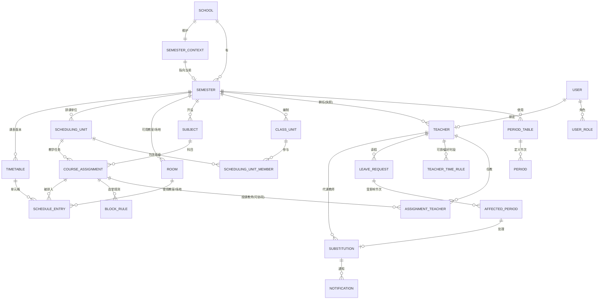
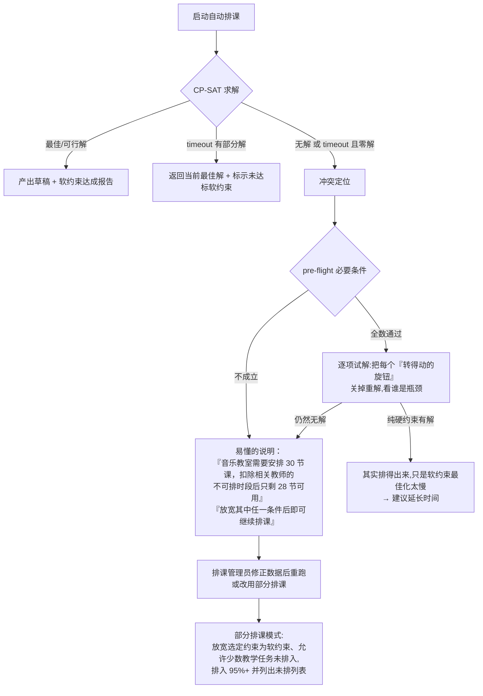
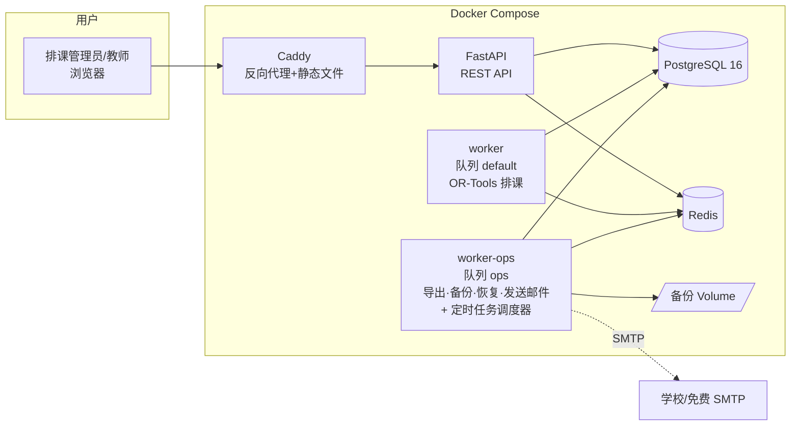
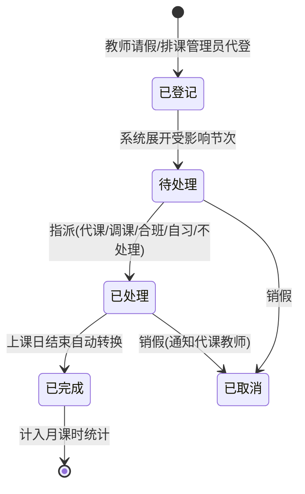

# 学校排课、调课与代课管理系统 — 架构规划文件

> 版本:v1.0(2026-07-07)
> 状态:规划定稿,交棒开发依据 [tasks.md](tasks.md)
> 授权:MIT
> 已定技术栈:**Python 3.12 + FastAPI + OR-Tools CP-SAT + Vue 3 + PostgreSQL 16 + Docker Compose**

---

## 0. 项目定位

一套**开源免费、单校自建、纯 Web** 的学校排课、调课与代课管理系统,服务对象为全国小学、初中、普通高中、综合高中、中职的**排课管理员**(主要操作者)、教务主任(审核/查看)与一般教师(查课表、请假、接代课通知)。

三大设计原则(所有后续决策的最高准则):

1. **不写死学制**：不同学校的差异统一表达为可配置数据（作息时间表、排课单位和约束），不在业务代码中增加地区或学制分支。公开模板仅保留“初中（空白模板）”，复杂示例由测试夹具构建。
2. **一键部署**：执行 `sudo docker compose up -d` 即可完成安装；备份、恢复和升级均提供界面按钮或单行命令。
3. **30 分钟上手**：首次登录进入“设置向导”，逐步完成初始化；所有页面使用全国中小学通用教务用语。

---

## 1. 需求规格书

### 1.1 用户角色与权限矩阵

| 功能 | 系统管理员 | 排课管理员 | 教务主任 | 教师 |
|---|---|---|---|---|
| 系统设置、账号管理、备份恢复 | ✅ | — | — | — |
| 基础数据维护（作息时间表/教师/班级/科目/教室/场地） | ✅ | ✅ | 查看 | — |
| 教学任务与排课（手动+自动） | ✅ | ✅ | 查看 | — |
| 课表发布 | ✅ | ✅ | 查看 | — |
| 调课与代课安排 | ✅ | ✅ | 查看 | 确认收到代课通知 |
| 请假登记 | ✅ | ✅(可代登) | 查看 | ✅(登记本人) |
| 查询课表(按班级、教师或教室/场地) | ✅ | ✅ | ✅ | ✅(全校可见或仅本人,可设置) |
| 课时统计报表 | ✅ | ✅ | ✅ | 仅本人 |

- 角色采 RBAC,一人可兼多角色(例:排课管理员同时是教师)。
- 本版本不增加调课、代课或课表发布审批流，由排课管理员完成业务操作，教务主任查看相关数据。

### 1.2 User Story 列表

优先级:**MVP**(M0–M5 必做)/ **v2** / **v3**。

#### A. 系统构建与基础数据

| # | User Story | 优先级 |
|---|---|---|
| A1 | 身为信息排课管理员,我能用一行 Docker 指令架好系统,并用默认管理员账号登录 | MVP |
| A2 | 身为排课管理员，首次登录后通过设置向导：选择初中空白模板 → 设置学年学期 → 填写作息时间表 → 导入教师/班级/科目 → 完成 | MVP |
| A3 | 身为排课管理员,我能自定义作息时间表(每天节数、每节起止时间、午休、早自习、周三下午不排课等) | MVP |
| A4 | 身为排课管理员,我能用 Excel 模板批量导入教师(姓名、任教科目、基本课时、行政职减课)与班级 | MVP |
| A5 | 身为排课管理员,我能维护教室/场地(普通教室、专用教室、实训场地,含容量与适用科目) | MVP |
| A6 | 身为管理员,我能批量创建教师账号并发送启用通知 | MVP |
| A7 | 身为排课管理员,我能开新学期并复制上学期的基础数据(教师/班级/科目/作息时间表) | MVP |
| A8 | 身为管理员,我能整合教育云端账号(OpenID Connect)登录 | v2 |
| A9 | 身为评估系统的用户,我能在全新系统中一键加载虚构的国内初中示例数据(18 个班、49 位教师、252 条教学任务),无需先手工录入大量数据即可体验自动排课；已有学期时禁止加载 | v1.2 |

#### B. 教学任务

| # | User Story | 优先级 |
|---|---|---|
| B1 | 身为排课管理员,我能创建教学任务:排课单位 × 科目 × 教师(可多位协同)× 每周节数 × 连堂规则 × 教室/场地需求 | MVP |
| B2 | 排课管理员可以创建走班分组（多班联排，如高中选修课程），并让分组内课程在同一时段开课 | MVP |
| B3 | 身为排课管理员,我能看到每位教师的教学任务节数统计,实时对照基本课时(超课时/不足以颜色标示) | MVP |
| B3-1 | 身为管理员,我能设置允许的超课时上限；教师教学任务总量超过“基本课时减行政减课数再加上限”时，创建、修改与 Excel 导入均被阻止并说明教师姓名。未维护基本课时(`base_periods=0`)的教师不执行此限制 | v1.2 |
| B4 | 身为排课管理员,我能用 Excel 批量导入教学任务数据 | MVP |
| B5 | 身为排课管理员,我能设置教师「不可排课时段」(兼行政、公假、培训)与「偏好时段」 | MVP |

#### C. 排课

| # | User Story | 优先级 |
|---|---|---|
| C1 | 身为排课管理员,我能在周课表格子上以拖拽方式手动排课,冲突单元格会实时以红色提示并说明原因 | MVP |
| C2 | 身为排课管理员,我能切换班级、教师、教室/场地三种课表视角 | MVP |
| C3 | 身为排课管理员,我能一键自动排课,看到进度,并在完成后看到软约束达成度报告 | MVP |
| C4 | 身为排课管理员,我能「锁定」部分单元格(如已敲定的任课教师时段),自动排课不得移动 | MVP |
| C5 | 身为排课管理员,自动排课无解时,系统告诉我最可能冲突的约束(如「王老师教学任务 22 节但可排时段仅 20 格」) | MVP |
| C6 | 身为排课管理员,我能保留多个课表草稿版本,比较后选一个发布 | MVP |
| C7 | 身为排课管理员,发布后全校师生可查询课表 | MVP |
| C8 | 身为排课管理员,我能对已发布课表做局部调整并重新发布(保留历次版本) | MVP |
| C9 | 身为排课管理员,我能设置高级软约束权重(科目分布均匀、教师空堂集中等) | v2 |

#### D. 调课与代课

| # | User Story | 优先级 |
|---|---|---|
| D1 | 身为教师,我能登记请假(日期范围、请假类型),系统自动列出受影响节次 | MVP |
| D2 | 身为排课管理员,我能替教师代登请假 | MVP |
| D3 | 身为排课管理员,对每一受影响节次,我能选择处理方式:代课/调课(对调)/合班/自习/公假不处理 | MVP |
| D4 | 身为排课管理员,系统推荐可代课教师(该时段空堂 → 同科目优先 → 当日已在校 → 代课课时平衡),一键指派 | MVP |
| D5 | 身为被指派教师,我会收到站内通知与 Email,可一键「确认收到」(实际工作中,排课管理员指派前已口头征得同意,因此**不设置拒绝流程**,2026-07-09 用户确定) | MVP |
| D6 | 身为排课管理员,我能看到每条代课通知的确认状态,对未确认者一键再次提醒 | MVP |
| D7 | 身为排课管理员,我能查看任一日期的「今日调课与代课看板」,打印当日调课与代课通知单 | MVP |
| D8 | 身为排课管理员,我能设置调课(甲乙教师对调两节课),系统验证双方均无冲突 | MVP |
| D9 | 身为排课管理员,月底我能导出代课课时统计表(依教师、依请假类型、依经费来源) | MVP |
| D10 | 身为教师,我能在手机浏览器顺利完成「查课表、请假、确认代课」 | MVP |
| D11 | 系统可对接校内差勤系统自动带入假单 | v3 |

#### E. 报表与整合

| # | User Story | 优先级 |
|---|---|---|
| E1 | 我能将班级、教师或教室/场地课表导出为 Excel、PDF、PNG(A4 纵向,适合公告栏张贴) | MVP |
| E2 | 我能导出全校总课表(大表)Excel | MVP |
| E3 | 系统每日自动备份数据库,管理员可一键下载备份文件、一键恢复 | MVP |
| E4 | 系统提供 OpenAPI 文件,供校务系统对接(只读课表 API) | v2 |
| E5 | 通知支持 webhook（供学校自行对接企业微信、钉钉、Teams 等平台） | v2 |

### 1.3 各学制差异对照表

| 差异点 | 小学 | 初中 | 普高 | 综合高中 | 中职 | 系统对应机制 |
|---|---|---|---|---|---|---|
| 节次结构 | 40 分/节,周三下午空 | 45 分/节 | 50 分/节 | 50 分/节 | 50 分/节 | **自定义作息时间表** + 全校性「不排课时段」 |
| 授课型态 | 班主任包班+任课教师 | 学科专任 | 专任+走班选修 | 课程走班 | 专业类别+实习 | **教学任务**均为「排课单位×科目×教师」,包班=同一教师大量教学任务 |
| 走班 | 无 | 少量校本课程 | 选修课程、分层教学 | 选修课程、分层教学 | 部分专业课程 | **走班分组**（多班联排且保持同一时段） |
| 连堂 | 少 | 少 | 实验课 2 连堂 | 专业课程实习 | 实习课 2–4 连堂 | 教学任务的**连堂规则**(N 连堂 × 每周 M 次) |
| 教室/场地限制 | 专用教室 | 专用教室 | 实验室 | 实习场所 | **实训场地容量是硬限制** | 教室/场地类型+容量,排入硬约束 |
| 特殊时段 | 班主任时间、晨会 | 周会、社团 | 综合实践活动、校本课程 | 同普通高中 | 同普通高中 | 作息时间表可标记“固定用途时段”，不参与排课 |
| 教师特例 | 任课教师跨多班 | 跨年级 | 兼行政减课 | 跨课程类别 | 企业兼职教师仅特定时段到校 | 教师「**可排课时段**」白名单 |

> 结论：学校差异收敛为四类可配置机制——**自定义作息时间表、弹性排课单位（班级/走班群组）、连堂规则和可排时段限制**。公开模板只提供初中科目参考项和空白作息时间表，不默认设置铃声、周课时或校历。

**混合学制学校(M0 后补充,2026-07-09)**:学制标签挂在**班级**(`class_units.track`)而非学校,因此完全中学(初中部+高中部)、普高+综合高中并存(如南大附中)、中职附设普通科、K-12 实验学校等混合型学校天然支持——同一学期内各班级各挂各的学制标签、各用各的作息时间表。配套要求:
1. `class_units.period_table_id`(nullable,空=学期默认作息时间表)——**每个班级必须可指定所属作息时间表**,排课引擎与冲突检查据此获取该班合法时段(任务卡 M1-6);
2. 晚间教学班以「另一套作息时间表」处理,不引入新学制标签;
3. 创建学期时可选“初中（空白模板）”；其他作息时间表由用户按学校实际情况新增，科目可通过 Excel 导入补充。

### 1.4 Out of Scope(明确不做)

- ❌ 成绩管理、学籍管理、差勤签核(仅接收请假事实,不做假单签核流程)
- ❌ 多校共用 SaaS、跨校数据交换
- ❌ 学生选课系统(选课结果以 Excel 导入走班群组名单;选课过程不在本系统)
- ❌ 原生 App(以响应式 Web 支持手机/平板)
- ❌ 大学/幼儿园学制
- ❌ 薪资计算(只产出代课课时统计表,计薪由人事/会计系统处理)

---

## 2. 领域模型与数据库设计

### 2.1 ER 图



### 2.2 核心实体定义

| 实体 | 说明 | 关键字段 |
|---|---|---|
| `app_setting` | 单校全局设置 | 不隶属学期，以 key/value 存放 SMTP、学校名称和超课时上限；增加普通设置无需新增数据库迁移 |
| `semester` | 学年学期 | 学年起始年（如 2026）、学期（1/2）、起止日期、状态（准备中/进行中/已归档） |
| `semester_context` | 当前学期工作上下文 | 单校单例行（`id=1`）；`current_semester_id` 是可空且唯一的学期外键，`revision` 用于并发切换校验；当前指针不复用学期生命周期状态 |
| `period_table` | 作息时间表 | 名称;一学期可有多套(如高中部/初中部各一套) |
| `period` | 节次定义 | 星期(1–5,可扩至 6)、第几节、起止时间、类型(一般课/早自习/午休/班主任时间/固定用途) |
| `teacher` | 教师 | 姓名、任教科目（多选）、基本课时、行政职务与减课数、是否外聘/企业兼职教师、在职状态、联系信息（电子邮箱、手机号、即时通讯账号，均选填）、绑定账号（`user_id`，可空外键 → users） |
| `class_unit` | 班级 | 年级、班名、学制标签(普/综/技/初中/小学)、专业类别(中职)、班主任、人数；班名在同一学期内唯一(`uq(semester_id, name)`) |
| `subject` | 科目 | 名称、领域/群别、需要教室/场地类型、默认连堂规则 |
| `room` | 教室/场地 | 名称、类型(普通/专科/实训场地/户外)、容量、适用科目 |
| `scheduling_unit` | **排课单位**（关键抽象） | 类型：`single`（单一班级）/`group`（走班群组）；走班群组通过 `scheduling_unit_member` 关联多个班级 |
| `course_assignment` | **教学任务** | 排课单位、科目、每周节数、教室/场地需求(类型或指定教室/场地)、是否锁定教室/场地 |
| `assignment_teacher` | 教学任务教师 | 支持协同教学(多教师);主讲/协同标记 |
| `block_rule` | 连堂规则 | 连堂长度(2–4)、每周次数(如「每周 6 节,其中 3 连堂×2 次」) |
| `teacher_time_rule` | 教师时段规则 | 类型:`unavailable`(硬:不可排)/`avoid`(软:尽量避开)/`prefer`(软:偏好);对应星期×节次 |
| `timetable` | 课表版本 | 状态:`draft` / `published` / `archived`;同学期可多份草稿,仅一份 published；`unscheduled` JSONB 保存部分排课时未排入原因，未排数量仍从实际课表重新计算 |
| `schedule_entry` | 课表单元格 | 课表版本、教学任务、星期、节次、`span`(连堂)、`room_id`(空=沿用教学任务教室/场地)、`locked` 标记;**唯一性约束在应用层+求解器验证**(教师/班级/教室/场地同时段不重复) |
| `leave_request` | 请假 | 教师、请假类型(公/事/病/婚/丧/产/培训)、起止日期时间、事由、登记人 |
| `affected_period` | 受影响节次 | 请假展开后的每一节课;状态机见 §5.3 |
| `substitution` | 调课与代课处理方式 | 类型:`substitute`(代课)/`swap`(调课)/`merge`(合班)/`self_study`(自习)/`cancel`(不处理);代课教师、是否计课时、经费来源标记 |
| `notification` | 通知 | 站内通知和电子邮件（v2 可通过渠道适配器增加 webhook）；类型、收件人、已读状态 |
| `user` / `user_role` | 账号与角色 | 本地账号和密码(bcrypt);角色:admin / director(教务主任)/ scheduler(排课管理员)/ teacher |
| `audit_log` | 操作轨迹 | 谁在何时改了什么(排课变更、调课与代课指派必记) |
| `constraint_config` | 软约束权重 | 每学期一组 key/value；保存 S1–S8 权重和 H10 上限等参数，复制新学期时可选择一并复制 |
| `wizard_state` | 设置向导进度 | 单条记录：当前步骤、完成状态和正在设置的学期；未完成时路由守卫会引导管理人员返回向导 |

### 2.3 关键设计决策

**D1|“排课单位”抽象用于支持不同学校的教学组织方式。**
排课的最小单位不是「班级」而是 `scheduling_unit`。单一班级的课 → `single`;走班选修(3 个班同时段拆成 5 组上不同课)→ 建一个 `group` 含 3 个班,群组内的多项教学任务由求解器强制排在同一时段。小学包班 = 班主任在自己班的大量 `single` 教学任务,无需特殊逻辑。

**D2|作息时间表数据化,绝不写死。**
「周三下午不排课」「第 8 节只有高三上」这类规则,全部以 `period.type` 与教师/班级的时段规则表达。完全中学(初中部+高中部节次时间不同)以多套 `period_table` 支持——这是市售系统常见痛点,必须在 schema 层解决。

**D3|学期快照,不做跨学期外键。**
教师、班级、教学任务均隶属于 `semester`。开新学期用「复制向导」拷贝数据,而非共用基础信息——避免「教师去年任教科目变动污染历史课表」的经典错误。跨学年报表用姓名+身份证后四位(可选填)做辅助对应。

**D4|课表版本化。**
`timetable` 支持多草稿并存与发布快照。学期中调整 = 复制 published 为新 draft → 修改 → 重新发布,旧版自动 archived。调课与代课记录挂在 published 版本上,不受草稿影响。

**D5|单校 schema,不做 multi-tenant。**
无 `tenant_id`。但所有查询统一以 `semester_id` 为范围,天然支持多学期并存与历史保存。

**D6|时区与日期时间政策(M0 检查新增)。**
三类时间严格区分,不得混用:
1. **系统时间戳**(created_at、locked_until、通知时间)→ `DateTime(timezone=True)`,统一 UTC aware;
2. **领域日期**(学期起止、请假日期、调课与代课日期)→ `Date`,无时区概念;
3. **领域时间**(节次起止时间)→ `Time`,即学校墙钟时间,无时区概念。
“今日/本周”等判定固定按 `Asia/Shanghai` 换算，不直接使用 UTC 日期。SQLite 测试环境返回 naive datetime 时，统一在读取层规范化为 UTC。

**D7|跨作息时间表的资源冲突以「墙钟时间重叠」判定(M1 检查新增,2026-07-09)。**
教师(H2)与教室/场地(H3)是跨班级共用的资源;当两堂课所属班级使用**不同作息时间表**时,节次号相同不代表时间相同、节次号不同也可能时间重叠(例:小学部 40 分/节的第 4 节 10:30–11:10,与高中部 50 分/节的第 3 节 10:10–11:00 重叠)。因此:
1. 冲突检查与 CP-SAT 建模中,教师和教室/场地的「同时段」定义 = **同星期且两节次的起止时间区间重叠**;两班同作息时间表时退化为 `period_no` 相等(常见情形,零额外成本);
2. 实现上预先计算「作息时间表两两之间的节次重叠矩阵」(每学期作息时间表数 ≤ 个位数,矩阵极小),冲突检查仍可达 <100ms;
3. 班级不冲堂(H1)只涉及单一班级自身的作息时间表,保持 `period_no` 判定;
4. **走班群组的成员班级必须使用同一作息时间表**(否则 H7「同时段开课」无意义),教学任务创建时验证并拒绝。

**D8|教室/场地互斥,容量仅作事前警告(M2 检查新增,2026-07-10)。**
v1 中同一教室/场地同时段至多一门课——H3 统一以互斥判定,手动冲突检查(M2-3 已如此实现)与 CP-SAT 建模(M3-2)语义一致。`room.capacity` 不参与求解,仅于 pre-flight 对「班级人数 > 教室/场地容量」提出警告;M3-2 验收的「实训场地容量限制」即以「互斥 + pre-flight 警告」解读。若日后需要让多组学生共用同一教室/场地(大型实训室、体育馆分区),再引入容量型占用,属 schema 不变的引擎扩充。

**D9|当前学期工作上下文与学期生命周期分离。**
`semester.status` 只描述准备中、进行中和已归档等生命周期；单例表 `semester_context` 的 `current_semester_id` 表示学校唯一的日常工作边界。首个学期自动成为当前学期；归档或删除当前学期时指针可暂时为空。只有系统管理员和排课管理员可以切换当前学期，客户端携带 `revision` 做乐观并发校验，服务端在切换与常规写入事务中锁定单例行，避免切换期间把结果写入旧学期。只有当前且未归档的学期允许常规编辑、导入、排课和发布；历史或归档学期保留查询及复制到新学期的能力。前端只读状态用于明确反馈，后端校验始终是最终边界。

---

## 3. 排课引擎设计

### 3.1 问题建模

排课 = 对每项教学任务的每一节,指派一个(星期×节次)时段与教室/场地,满足所有硬约束并最大化软约束加权分数。这是经典的 **School Timetabling Problem**,采 **Google OR-Tools CP-SAT** 求解。

**决策变量**:`x[a, s] ∈ {0,1}` — 教学任务 a 的课排在时段 s;连堂以「起始时段变量 + 区间占用」建模。教室/场地在需求非唯一时另设 `r[a, s, room]` 变量,占多数的「固定教室/场地」(班级教室)则预先绑定以缩小搜索空间。

### 3.2 约束条件分类

**硬约束(违反即无效解)**

| 编号 | 约束 | 说明 |
|---|---|---|
| H1 | 班级不冲堂 | 同一班级(含所属走班群组)同时段至多一门课 |
| H2 | 教师不冲堂 | 同一教师同时段至多一门课(含协同) |
| H3 | 教室/场地不冲堂 | 同一教室/场地同时段至多一门课;实训场地容量限制 |
| H4 | 教师不可排时段 | `teacher_time_rule.unavailable`(兼行政、企业兼职教师到校日、公假) |
| H5 | 节次有效性 | 只能排在 `period.type = 一般课` 的时段 |
| H6 | 连堂完整性 | 连堂课必须连续且不跨午休 |
| H7 | 走班同步 | 同一走班群组的所有教学任务排在同一时段 |
| H8 | 周节数守恒 | 每项教学任务排入的节数 = 设置的每周节数 |
| H9 | 锁定单元格 | `schedule_entry.locked` 的单元格不得移动 |
| H10 | 每日科目上限 | 同班同科目每日至多 N 节(默认 2,可设置)。**只计节长 1 的单元格**——连堂是一次上完的整块,不计入亦不受限;但同一门课剩下的单节仍受限。定义以 `app/solver/validator.py` 为准 |

**软约束(加权计分,权重可调)**

权重存于 `constraint_config`(key/value,未设置则回退默认);**权重 0 = 关闭该项**。
高=8、中=4、低=1。目标函数 = Σ(权重 × 惩罚),CP-SAT 最小化之。

| 编号 | 约束 | 默认权重 |
|---|---|---|
| S1 | 教师偏好时段(prefer 加分 / avoid 扣分) | 中 |
| S2 | 同班同科目分散于不同日 | 高 |
| S3 | 教师每日授课节数上限(默认 ≤6) | 高 |
| S4 | 教师空堂集中(减少零碎空堂) | 低 |
| S5 | 主科(`subject.is_major`)优先排上午 | 中 |
| S6 | 教师连续授课 ≤3 节 | 中 |
| S7 | 班主任的课优先排在自己班的第一节(初中小) | 低 |
| S8 | 全校教师偏好达成率的公平性(最差者优先) | 低 |

**达成度报告**(`app/solver/report.py`)与建模不共用代码,从课表本身重新推导,
输出「满分/得分/未达成明细」的易懂说明列表。其 `total_penalty` 与 CP-SAT 的 `objective`
刻意用不同尺度:目标函数以「超出的节数」计价(让 solver 有梯度可下降),
报告以「未达成的次数」计价(让排课管理员知道要修几个地方)。

### 3.3 选型理由与性能预估

- **CP-SAT 而非基因演算法/模拟退火**:CP-SAT 对硬约束是「证明式满足」,不会生成违反硬约束的解;GA/SA 需自行调参且无法证明无解。CP-SAT 为 anytime solver,随时可中断取当前最佳解,天然支持「进度条+提前结束」。
- **规模预估**:60 班 × 35 节 ≈ 2,100 节课,变量量 10⁵ 级,CP-SAT 在 4 核心机器约 1–5 分钟可得高质量解(业界同类系统实测区间)。默认 timeout 10 分钟,可设置。
- **执行架构**:求解跑在独立 worker 容器(RQ + Redis 队列),不阻塞 Web;进度以 polling API 报告(前端每 2 秒),避免 WebSocket 增加部署复杂度。
- **进度与心跳**:进度存于独立的 Redis hash(`solve:{job_id}`),不放 RQ job meta——RQ 只知道「执行中/失败」,无法说明「已找到 12 个解、目前目标值 148」。worker 每 2 秒发送一次心跳;API 读到 `running` 但心跳超过 30 秒未更新时,即判定 worker 已中断,报告明确错误而非让前端永远转圈。
- **提前结束 vs 取消**:`stop` 停止搜索但**保留当下最佳解**并写出结果草稿;`cancel` 停止并丢弃。两者都经由 `CpSolver.stop_search()`,由背景线程触发。

### 3.4 无解与降级策略



- **冲突定位是本系统的差异化重点**:市售系统只回「排不出来」,本系统要说出**是哪几件事凑在一起、松开哪一个就好了**,并附上具体数字。
- **事前检查(pre-flight check)**:排课前先跑廉价的必要条件检查(每位教师教学任务数 ≤ 可排时段数、每个教室/场地的需求 ≤ 供给、每班周节数 ≤ 可用节次),拦截 80% 的数据错误,不浪费求解时间。必要条件不成立本身就是无解的证明,数字现成,不必启动 solver。

#### 定位方法:逐项试解(deletion filter),而非 assumption / unsat core

原设计是「每类硬约束挂 assumption literal,无解时取 unsat core」。**实测后放弃**:

| 同一份数据(6 班共用一间音乐教室) | 证明无解耗时 |
| --- | --- |
| 纯硬约束模型 | **0.8 秒** |
| 挂上 assumption literal 的模型 | **60 秒仍证不完** |

原因是 enforcement literal 让 presolve 认不出「30 节课塞进 28 格」的鸽笼结构;换过三种编码(单条大线性、逐格二元子句、只挂部分约束)都一样。

改用**删除法**:把每个旋钮整组关掉、重新建一个干净的模型求解——每次求解都完整 presolve,上例整套定位约 2~3 秒。附带的好处是**每一条结论都被一次真实的求解验证过**:报告说「放宽音乐师1 的不可排时段就排得出来」,是因为真的排出来了。

- 旋钮 = 排课管理员改得动的东西:`H4` 某位教师的不可排时段、`H3` 某个教室/场地的互斥、`H10` 全校的每日科目上限、`H9` 锁定的单元格。
- `H1`(班级同时段一门课)与 `H2`(教师同时段一门课)**不是旋钮**——没有东西可转,而且真正的成因(某位教师教学任务超过可排格数)pre-flight 已经算得出来。
- **报告的诚实边界**:`each` 模式的每一项都被一次真实求解验证过(关掉它就排出来了),
  这个结论恒为真;但**列表是否完整**、以及 `joint` 的组合是否最小,取决于时间是否用完、
  以及每次试解是否在时限内判定得出来。任何一次试解回 `unknown`(没能证明可行、也没能证明无解)
  都会把 `complete` 降为 `False`,`structural` 的措辞也随之收敛——
  **绝不宣称一件从未被证明的事**。
- 报告分三种:
  - `each`:每一项各自都是瓶颈,**放宽任何一项即可**(最常见)。
  - `joint`:必须同时处理多项(先累加到可行,再逐一剔除不必要的)。
  - `structural`:旋钮全转到底仍然无解,问题出在教学任务总量,列出最吃紧的班级与教师。
- **超时且零解时也要跑定位**:带着软约束目标函数的 CP-SAT 常常证不出 INFEASIBLE(见上表)。定位以纯硬约束求解,能分辨「不可能」与「只是慢」——这两件事的处理方式完全不同。

#### 部分排课(partial scheduling)

- 每个 lesson 多一个「未排入」变量,`H8 周节数守恒` 因此降级为高权重软约束;模型永远有解(最差是整张表空着)。
- 某项教学任务因硬约束完全没有候选时段时，部分排课会直接将其列入未排列表并保存原因，其余教学任务继续求解；一般模式仍会报告输入错误。
- 未排节数按排课单位统计。走班分组中的多门课程在同一时段开设，少一个时段只计少一课时，不能按组内教学任务重复累加。
- 用户可另外勾选放宽 `H4` / `H9` / `H10`。**`H1` / `H2` / `H3` 永远不可放宽**——一位教师不能同时出现在两间教室、一间教室不能同时容纳两班,那是物理,不是政策;放宽只会生成一张没有人能照着上课的课表。
- 惩罚量级刻意拉开:**未排入(10000) ≫ 违反被放宽的约束(1000) ≫ 软约束(1~8)**。
  这个顺序是**正确性前提**,不是调参偏好:软约束权重因此硬性上限 `MAX_WEIGHT = 100`
  (一节课最多参与约 8 个惩罚项 → 软约束总代价 < 800 < 1000)。若允许把某项软约束设到
  20000,solver 会理性地「丢掉一节课」去换取分散度——那是灾难。勾了「可放宽教师不可排时段」,意思就是「宁可让老师委屈一节,也不要让这门课排不进去」。
- 因此部分排课的 `objective` 与一般模式**尺度不同**(被未排入的惩罚灌爆),UI 显示「未排 N 节」而不是目标值。
- pre-flight 的把关也随之放宽:部分排课只挡**结构性**错误(连堂比整段连续节次还长、走班群组节数不一致、没有该类型的教室/场地)——那些连模型都建不起来;「教师教学任务超量」「教室/场地不够」正是部分排课要处理的事。
- 结果统一再交给 `validator` 检查:除了被明确放宽的那类约束以外,其余硬约束必须一格都没违反。**「少排几节」不可以偷偷变成「排错几节」。**

---

## 4. 技术架构

### 4.1 技术选型

| 层 | 选型 | 理由 |
|---|---|---|
| 前端 | **Vue 3 + TypeScript + Vite + Pinia + Naive UI** | 生态成熟、学习曲线平缓，Naive UI 组件完整且原生支持 TypeScript |
| 课表互动 | 自制 CSS Grid 课表 + HTML5 Drag & Drop(封装为 `TimetableGrid` 组件) | 课表拖拽逻辑高度领域化,通用组件反而绑手脚 |
| 后端 | **Python 3.12 + FastAPI + SQLAlchemy 2.0 + Alembic + Pydantic v2** | 与 OR-Tools 同语言；FastAPI 自带 OpenAPI 文件(正式部署默认关闭，可通过 `API_DOCS_ENABLED` 开启)；类型完整 |
| 排课引擎 | **OR-Tools CP-SAT**(独立 `solver/` 模块,与 Web 解耦) | 见 §3.3 |
| 任务队列 | **RQ + Redis** | 极简、纯 Python;排课与 Email 发送均走队列 |
| 数据库 | **PostgreSQL 16** | 主流、可靠;pg_dump 备份简单 |
| 反向代理 | **Caddy** | 配置文件 3 行、自动 HTTPS(有域名时)、自动 HTTP 降级(内网 IP 时)——对学校信息组最友善 |
| 导入导出 | openpyxl(Excel)、WeasyPrint(PDF)、Pillow(PNG) | 纯 Python、无外部二进位依赖 |
| 测试 | pytest + Vitest + Playwright | 各层主流 |
| CI | GitHub Actions | 开源标配 |

### 4.2 系统架构图



前端构建为静态文件由 Caddy 直接服务(不需 Node 容器),共 **6 个容器**:caddy(web)、api、worker、worker-ops、postgres、redis。

**D9 后台任务分两条队列(M6-2)**:`default` 只跑自动排课,`ops` 跑导出/备份/恢复/发送邮件与定时任务,各由一个 worker 进程监听(同一个镜像)。理由是快慢任务不该互相堵住——一次 60 班排课会占住 worker 好几分钟,而那正是排课管理员最常按「导出课表」的时候;单一队列下导出会排在排课后面直到超时失败。排课永远只走 `default`,故 `worker-ops` 不加载求解引擎,内存预算低得多(1536MB vs 512MB)。

定时任务(每日备份、调度器心跳)统一排进 `ops`,并由 `worker-ops` 以 `with_scheduler=True` 取出执行:排课 worker 一次求解可能持续数分钟,不适合负责需要准时执行的任务。

**恢复仍须在排课进行中拒绝(409)**——这条在分队列后依然成立,但理由是**数据安全而非排队**:pg_restore 会覆盖整个数据库,而排课 worker 正要把结果写回同一个库。

### 4.3 部署方案

**主线:Docker Compose 自架**

```
安装三步骤(deploy/README 首页):
1. 安装 Docker(附各操作系统说明)
2. 运行 Windows 或 Linux/macOS/NAS 一键安装脚本；也可手工下载 docker-compose.yml 与 .env 示例
3. 在浏览器打开 `http://<主机IP>`，进入设置向导或加载虚构示例数据
```

- **硬件最低需求**:2 核 4GB RAM、10GB 磁盘(自动排课建议 4 核 8GB;求解期间 CPU 满载属正常,文件需注明)。兼容 x86-64 与 ARM64(NAS/树莓派),CI 产出双架构 image。
- **升级**：执行 `sudo docker compose pull && sudo docker compose up -d`，Alembic 会在 API 启动时自动迁移。
- **副线:低成本 VPS**:文件提供「VPS + 域名 + Caddy 自动 HTTPS」指引,适合无校内主机的小校;强调数据在自己 VPS、非 SaaS。

### 4.4 数据导入/导出与整合

- **导入**:系统内置可下载的 Excel 模板(教师、班级、科目、教学任务、走班名单),上传后逐行验证,错误以「第 N 行:原因」列表报告,全对才入库(事务性)。
- **导出**:班级、教师、教室/场地课表 → Excel / PDF(A4 纵向)/ PNG;全校总表 → Excel;代课课时统计 → Excel。
- **校务系统衔接**:v2 提供只读 REST API(API key 授权)+ OpenAPI 文件;不主动做特定厂商对接(各县市校务系统版本混乱,由社群依 API 自行开发)。

### 4.5 账号与安全

- **MVP:本地账号**。管理员批量创建教师账号(导入 Excel 时一并生成),首次登录强制改密码;bcrypt 哈希;session cookie(HttpOnly + SameSite,签名式无状态 token)。
- **Session 撤销**:token 内嵌密码指纹(password_hash 尾段),修改密码会使所有现有 session 失效;账号停用(`is_active=false`)在下一次请求检查时立即生效。
- **登录防暴力**:连续失败 5 次锁定 15 分钟(M0-2 已实现,参数可设置)。
- **教育云端账号(OpenID Connect)评估**:技术上为标准 OIDC,可行;但各县市申请流程不一且需学校行政程序,故列 **v2 选配**,MVP 不阻塞。程序面预留:`user.auth_provider` 字段 + 登录流程策略界面。
- **个人信息**:教师个人信息最小化搜集(不收身份证全码);`audit_log` 记录排课与调课与代课变更;HTTPS 由 Caddy 处理。
- **备份恢复**:每日 02:00 自动 pg_dump 至 volume(保留 30 份);管理 UI 提供「立即备份、下载、上传恢复」;文件教学 NAS 调度二次备份。

---

## 5. UI/UX 规划

### 5.1 信息架构与关键页面

```
侧边栏(排课管理员/系统管理员视角；教师只显示与本人相关的页面):
├── 仪表盘(今日调课与代课摘要、待办)
├── 课表查询(按班级、教师或教室/场地，含导出)
├── 基础数据
│   ├── 学期与作息时间表
│   └── 教师/班级/科目/教室/场地(含 Excel 导入)
├── 排课作业
│   ├── 教学任务管理
│   ├── 排课工作台(拖拽界面)
│   ├── 自动排课
│   ├── 版本与发布
│   └── 课表组件示例
├── 调课与代课(请假登记、处理工作台、今日看板、记录、课时统计、通知确认)
└── 系统管理(学校信息、示例数据、超课时上限、备份恢复、SMTP、重新启动向导；限系统管理员)

独立页面:登录、首次登录强制修改密码、设置向导和 A4 公告打印。
```

**排课工作台(核心页面)线框**:

```
┌─────────────────────────────────────────────────────────┐
│ 视角:[班级▼ 301班] [教师] [教室/场地]   版本:草稿A ▼  [自动排课] │
├───────────────┬─────────────────────────────────────────┤
│ 未排教学任务        │        一   二   三   四   五              │
│ ┌───────────┐ │  第1节 ┌──┐┌──┐┌──┐┌──┐┌──┐             │
│ │语文 王老师  │ │       │语文││  ││数学││  ││英语│             │
│ │剩 2 节     │ │  第2节 │🔒 ││  ││    ││  ││    │             │
│ ├───────────┤ │  ...   └──┘└──┘└──┘└──┘└──┘             │
│ │数学 李老师  │ │  拖入时:可放=绿框、冲突=红框+浮窗原因         │
│ │剩 4 节     │ │  已排格:点击→锁定/移除/查看;🔒=锁定          │
│ └───────────┘ │  周三下午单元格反灰(不排课时段)                │
└───────────────┴─────────────────────────────────────────┘
```

- 拖拽时前端实时调用 `POST /check-conflict`(<100ms)渲染可放/冲突状态;放下后立即保存(草稿自动存储)。
- 教师视角同一 grid 组件换数据源;冲突检测共用同一后端服务,避免双套逻辑。

### 5.2 设置向导(30 分钟上手的关键)

五个步骤均可返回修改：**① 选择“初中（空白模板）”**（带入科目参考项和空白作息时间表）→ **② 设置学年学期** → **③ 填写作息时间表** → **④ 下载 Excel 模板并导入教师/班级** → **⑤ 完成并进入教学任务管理**。

### 5.3 调课与代课状态机



> **2026-07-09 决策：不设置“邀请/婉拒”流程。** 排课管理员在线下确认代课安排后在系统中登记，系统通知用于正式告知。指派立即生效；被指派教师可点击“确认收到”，该状态仅表示已读，不改变课程安排。排课管理员可以在看板查看确认情况并再次提醒。

- **代课推荐排序**:该时段空堂(硬性)→ 同科目 → 当日已有课(已在校)→ 本月代课课时少者优先(公平)。每位候选人显示排序理由。
- **调课(swap)**:选甲教师受影响节次 ↔ 乙教师某节次,系统验证交换后双方及两班均无冲突才允许。
- **通知渠道（2026-07-09 评估更新）**：以 `NotificationChannel` 接口分层，MVP 实现**站内通知**（始终可用）与**电子邮件**（配置 SMTP 后启用）；v2 可按需增加企业微信、钉钉或其他平台的 webhook 适配器。手机号和即时通讯账号仅供人工联系，不发送付费短信。收件人解析规则为：`teacher.user_id` → 站内通知，`teacher.email` → 电子邮件；教师没有系统账号但填写了电子邮箱时仍可收信。教师端的课表查询、请假和代课确认均需支持手机浏览器。

---

## 6. 开发交棒计画

> 完整 Milestone 切分、任务卡(含验收标准)、项目目录结构与测试策略,见 **[tasks.md](tasks.md)**。开发者(Claude Opus 4.8 / Sonnet 5)每次取一张任务卡实现,完成后依卡上验收标准自我验证。
